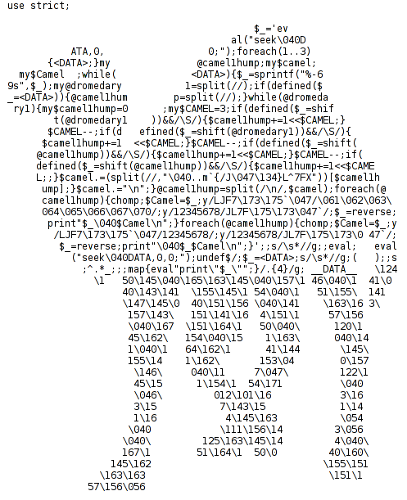

- title : How slow your code is?
- description : . Denver Dev Day (November 22, 2019)
- author : Grigoriy Belenkiy
- theme : simple
- transition : convex

***
- data-background : ./images/sponsors-slide.png
- data-background-transition : none

' Sponsors slide (required by organizators)

***

### How slow your code is?

<small>Grigoriy Belenkiy 
Software engineer at 
 
<a href="https://twitter.com/@grishace/">@grishace</a>
 
 
Denver Dev Day 
November 22, 2019</small>

***

### TIMTOWTDI

---

***

### Micro-Benchmarking

<ul>
<li>DateTime.Now&nbsp;&mdash;&nbsp;na&iuml;ve</li>
<li>System.Diagnostics.Stopwatch&nbsp;&mdash;&nbsp;better</li>
<li>BenchmarkDotNet</li>
</ul>

***

### BenchmarkDotNet

---

### BenchmarkDotNet

* .NET Framework (4.6+), .NET Core (2.0+), Mono, CoreRT
* C#, F#, Visual Basic
* Windows, Linux, macOS

---

### BenchmarkDotNet

* Standard benchmarking routine
* Execution control
* Statistics
* Relative performance
* Memory diagnostics
* Parametrization
* Powerful reporting system

' Standard benchmarking routine:
' generating an isolated project per each benchmark method; 
' auto-selection of iteration amount; warmup; overhead evaluation; and so on
' Execution control: 
' BenchmarkDotNet tries to choose the best possible way to evaluate performance, but you can also 
' manually control amount of iterations, switch between cold start and warmed state, set the accuracy level,
' tune GC parameters, change environment variables, and more
' Statistics:
' by default, you will see the most important statistics like mean and standard deviation; 
' but you can also manually ask for min/max values, confidence intervals, skewness, kurtosis, quartile, 
' percentiles, or define own metrics
' Comparing environments:
' Easy way to compare different environments (x86 vs x64, LegacyJit vs RyuJit, Mono vs .NET Core, and so on)
' Relative performance:
' you can easily evaluate difference between different methods of environments
' Memory diagnostics: 
' the library not only measure performance of your code, but also prints information about memory traffic 
' and amount of GC collections
' Disassembly diagnostics:
' you can ask for an assembly listing with the help of single additional attribute
' Parametrization:
' performance can be evaluated for different sets of input parameters like in popular unit test frameworks
' Environment information:
' when your share performance results, it's very important to share information about your environment; 
' BenchmarkDotNet automatically prints the exact version of your OS and processor; amount of physical CPU, 
' physical cores, and logic cores; hypervisor (if you use it); frequency of the hardware timer; the JIT-compiler 
' version; and more
' Command-line support:
' you can manage thousands of benchmark, group them by categories, filter and run them from command line
' Powerful reporting system: it's possible to export benchmark results to markdown, csv, html, plain text, png plots

***

### Demo

***

### Questions?

 
[https://github.com/grishace/ddd-bench](https://github.com/grishace/ddd-bench)

[https://benchmarkdotnet.org/](https://benchmarkdotnet.org/)
